# VS Code에서 Markdown 사용법
VS studio 에서 Ctrl + N으로 파일 생성 후 오른쪽 밑에 Markdown표시 확인 후 오른쪽 위 버튼 open preview to the side 클릭
# Git과 Github 사용법
### Git의 주요기능
- 버젼 관리 (수정이력 관리)
- 협업 체계 
### Github
- 온라인 상에 저장소를 만들어 원격으로 관리 
# Git 사용방법
- Command-Line Interface, CLI (명령행 인터페이스)
- git download (git-scm.com/downloads)
- Git bash here 
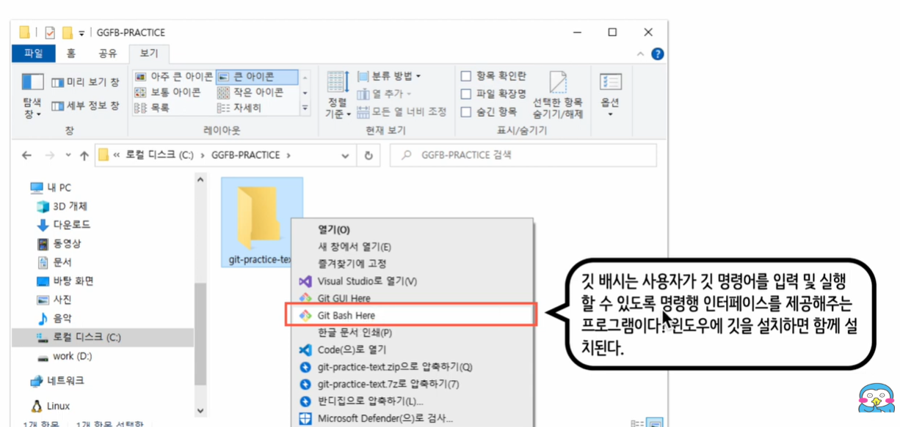

- Git 세팅하는 방법
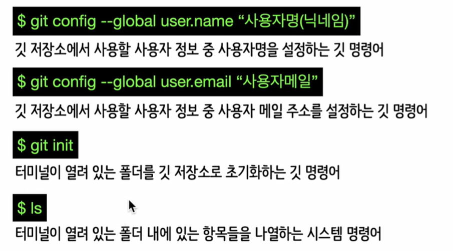

- Git이 설치 된 컴퓨터에서 git을 쓰면 내용이 나오지만 아니면 에러가 뜬다
- clear라는 명령어: clear해줌
- git config user.name : 이름 확인
- git config user.email: 이메일 확인
- ls -al: hidden folder까지 볼 수 있음
### Git 저장소 이력 관리
- 깃 프로젝트는 내부에 가상의 관리 영역을 만들어 파일의 상태를 구분하고 버전을 관리
- 관리 영역은 세가지로, 각 영역의 이름과 역할은 다음과 같음
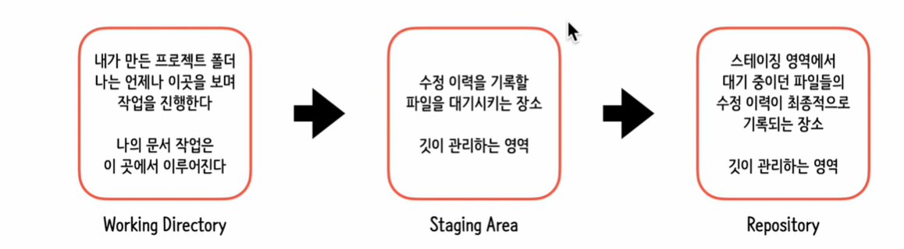

- Working Directory에는
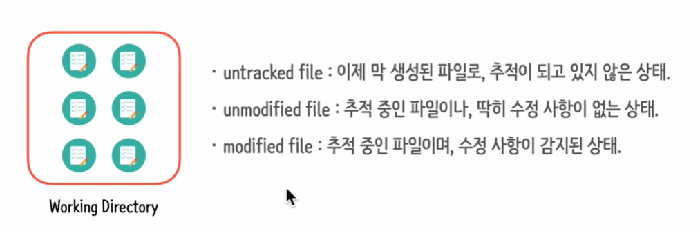
- Working directory to Staging Area
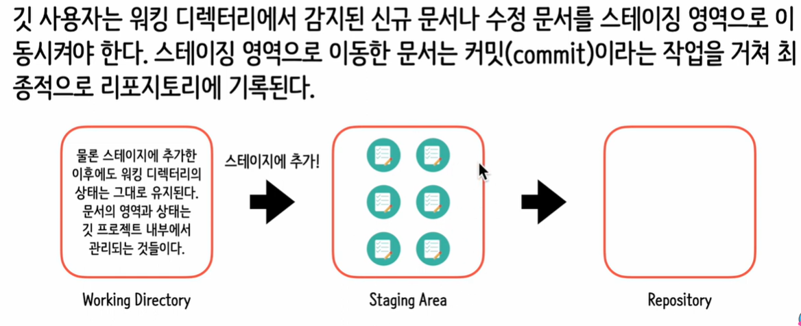
- Staging Area to Repository
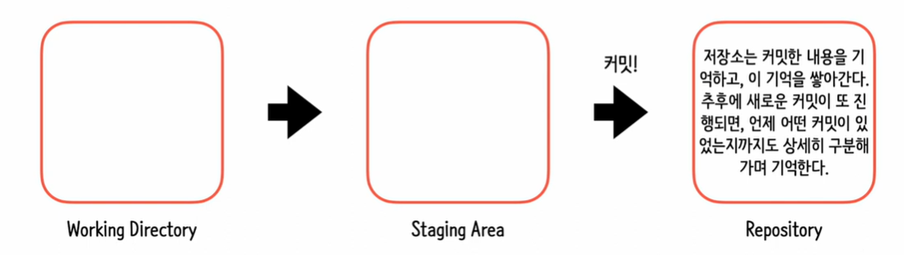
- git 명령어
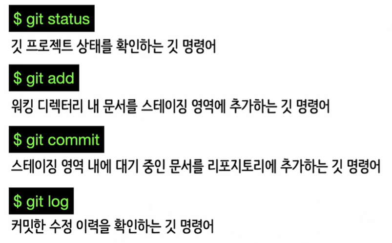

- 파일 생성 시 touch text1.txt git status- untracked file
- Git commit 이후 shift I 해서 "나의 첫번째 commit" 을 쓴 후 esc로 나가고 shift : 에서 wq 엔터 
- git log (로그를 다 볼 수 있음 )
- git commit -m "" :에디터를 열시 않고 메세지를 입력 하겠다라는 명령어 (바로 commit 할 수 있음)

### Gitignore

- 깃 프로젝트 내 문서 중 수정 이력에서 제외하고 싶은 문서가 있다면 이를 추적 대상에서 완전히 제외시킬 수 있음. 이때에 깃 설정 파일인 .gitignore를 사용함 
    - .gitignore은 처음부터 존재하는 파일이 아니므로, 직접 만들어서 사용해야 한다. 시스템 명령어 touch를 사용하면 새 파일을 생성 할 수 있다
- touch .gitignore (나만 알고 싶음)
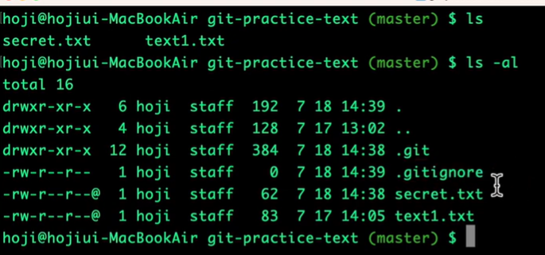

- nano .gitignore --> sectet.txt 추가 (나만 알고싶은 파일 넣기) ->ctrl X ->Y
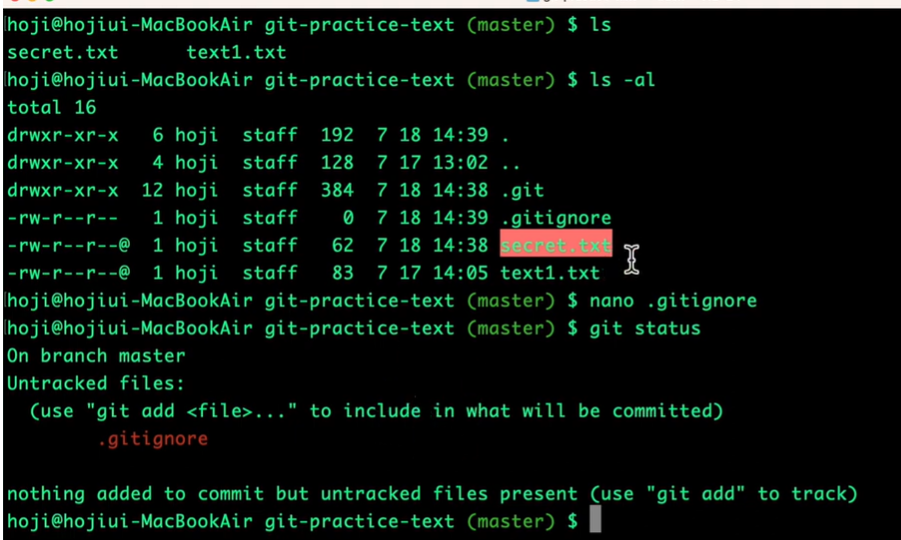

### 커밋 이력 자세히 보기
- 커밋해시: 커밋 기록에 대한 고유 식별자
- 브랜치명: 기존 저장소에서 분기된 저장소의 복사본인 '브랜치'의 이름
- HEAD: 현재 작업중인 브랜치를 가리키는 포인터 (참조자) 
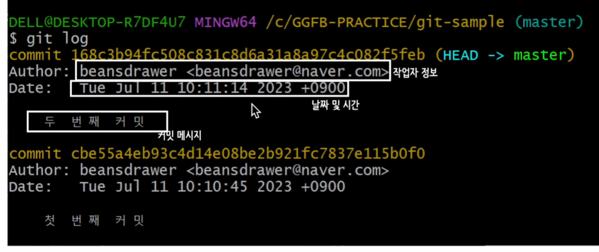
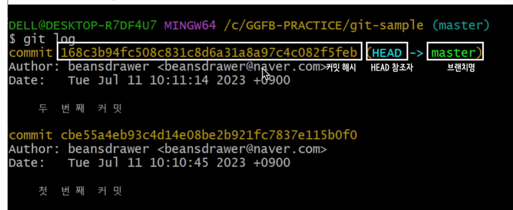

- 깃 로그 옵션
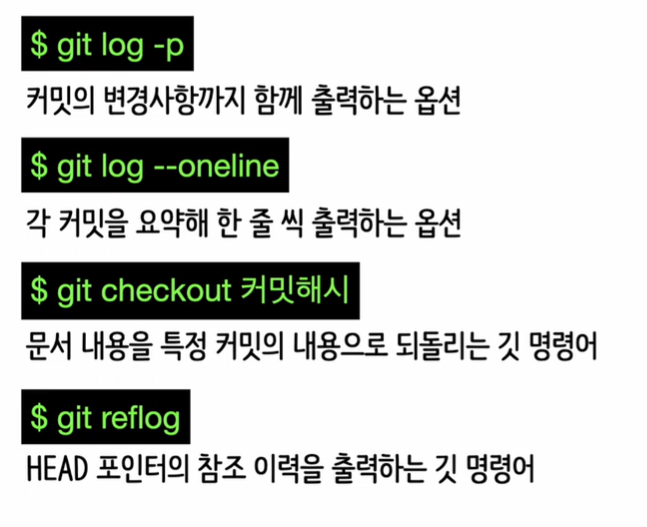

- git log -p: 알파벳 q를 누르면 나갈 수 있음 : git log -p/ git log -1/ git log p -1/ git log --oneline 
- 과거의 상태로 돌릴 때: git checkout 커밋해시 (앞의7자리)
- git checkout 최신커밋 돌아갈때 해시가 기억 안난다면 git reflog 

### 실수에 대응하기

- 실수로 git add 명령을 수행 해 버린 경우, **git rese**t 명령어를 입력하면 스테이징 영역에 올라가 있던 파일을 초기화 할 수 있다. 즉, 워킹 디렉터리로 되돌릴 수 있다 
- 실수로 git commit 명령을 수행 해버려 잘못된 커밋 이력이 추가된 경우, git reset명령어와 커밋해시를 함께 입력하면 커밋 이력 되돌리기가 수행된다. git reset 커밋 되돌리기를 수행할 때는 세가지 옵션 중 하나를 선택할 수 있다.
    - hard, mixed, soft
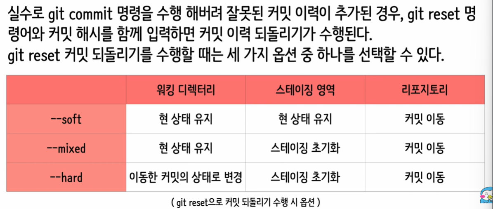

- git revert
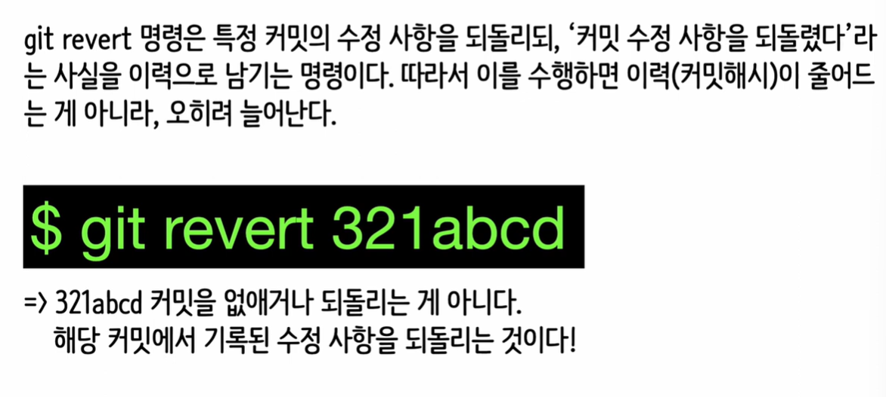

- Staging area에서 working directory로 돌리고 싶을 때 git reset 파일명
- 실수로 commit했을 때는 git reset 돌아가고 싶은 hash7자리 넣고 -옵션 쓰기 
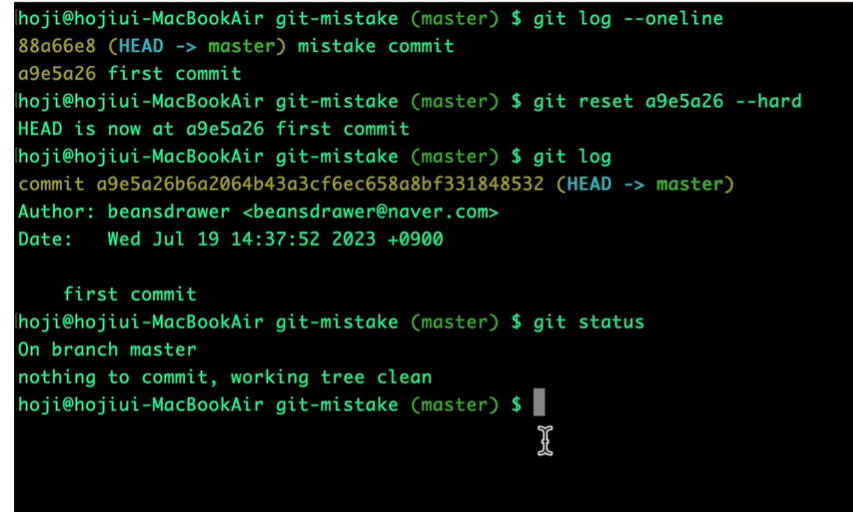

- 실수 한거 까지 남기고 싶다: git revert (뭐로부터 되돌리겠다)
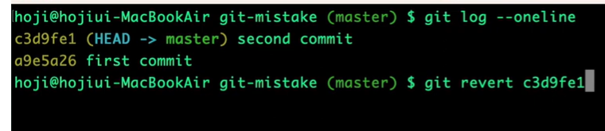
-> VI가 뜸 

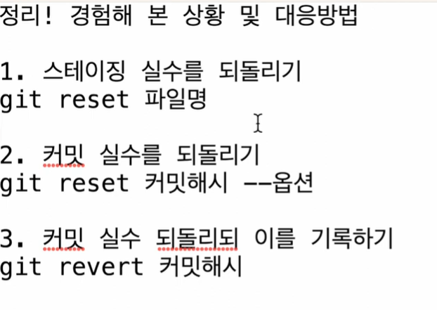

### 브랜치 관리하기

- 개발을 하다보면 코드를 여러개로 복사해야 하는 일이 생기는데, 코드를 통쨰로 복사하고 나서 원래 코드와는 상관없이 독립적으로 개발을 진행할 수 있도록 하는 것: 브랜치의 사용 목적
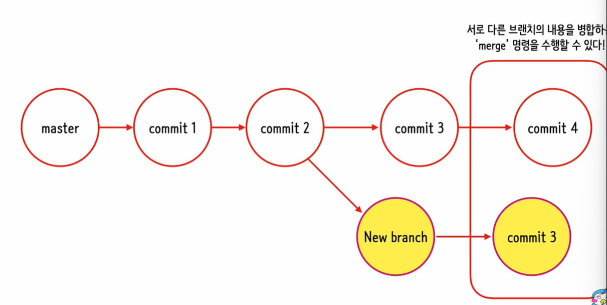
- Git branch 관련 명령어
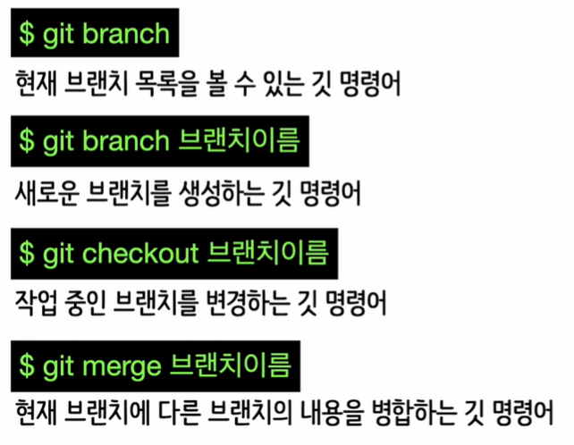
- 샘플
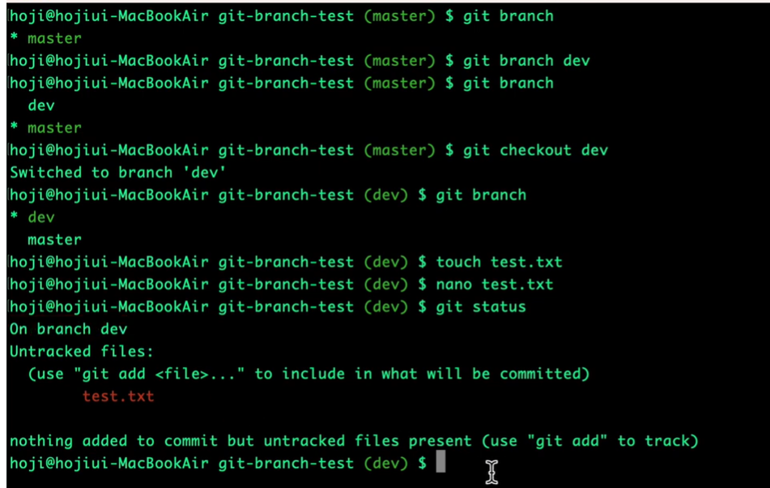

- git branch -d dev (dev 브랜치 삭제)

### 깃허브 원격 저장소

- 내 PC에 있는 깃 저장소를 깃허브가 제공하는 클라우드 저장소에서 업로드해서 보관할 수 있음
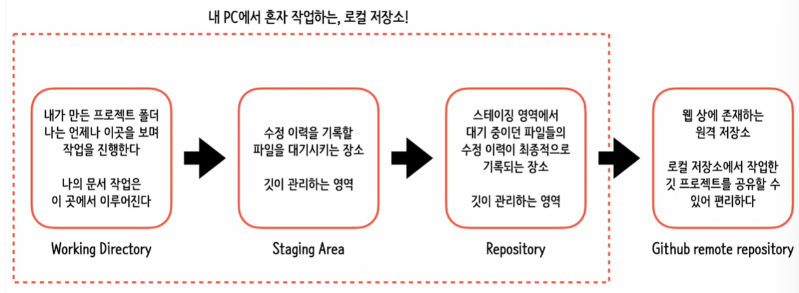
- github.com 후 회원가입 필요
- 원격 저장소 이용 관련 명령어들:
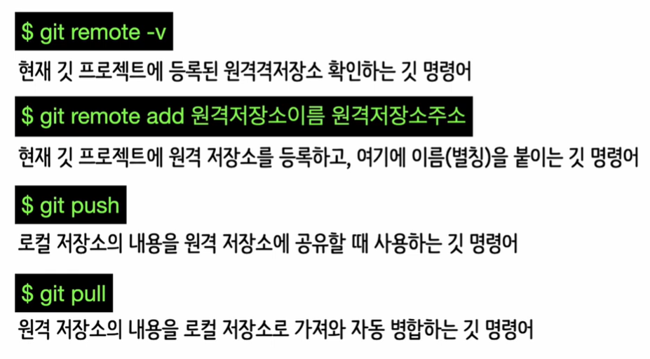

- 깃허브에서 repository-> new -> Repository name-> Create repository 
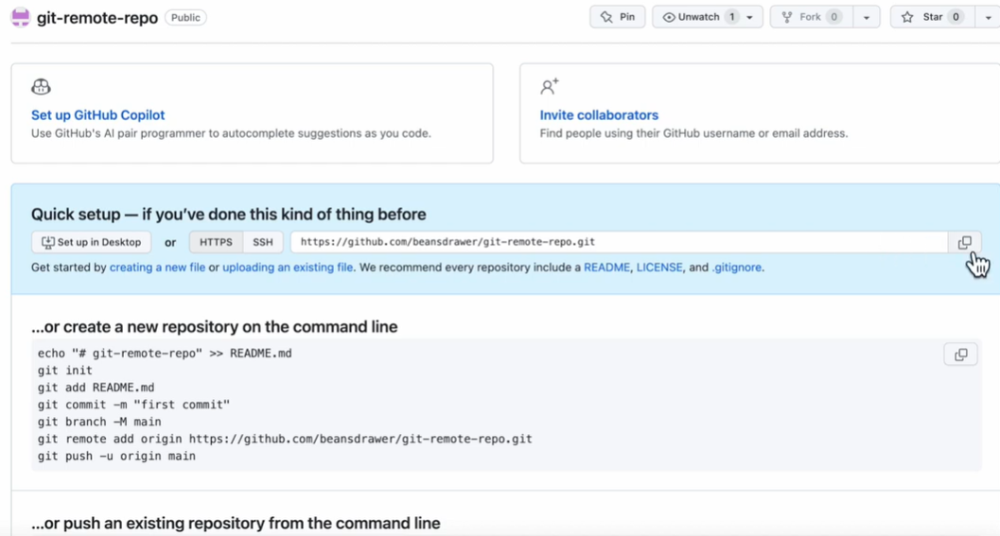

- git remote add origin + 위의 주소 
- git remote -v
- git push / git push -u origin master (로그인 한번 해주어야함)

#### 깃허브에 있는 파일을 -> 내 local에 옮길때 

- 주소 code로 받기
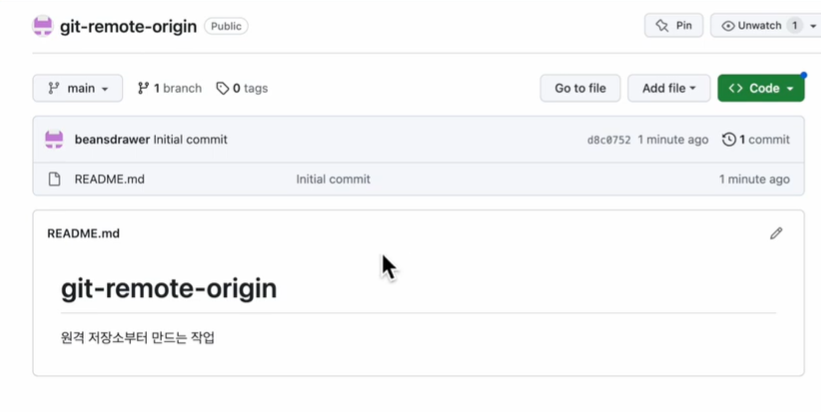

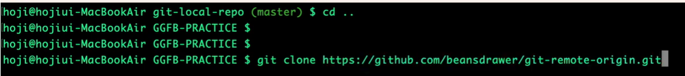

- 깃허브에서 폴더 생성 후 다시 가져 오는 법 git pull
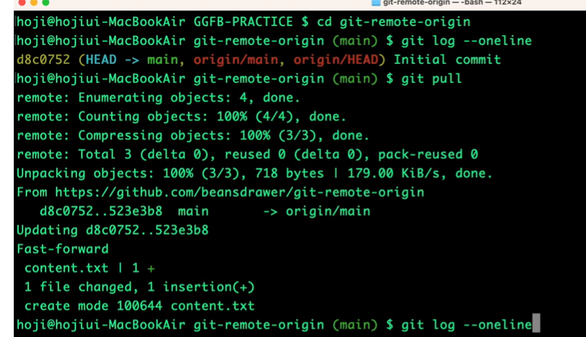